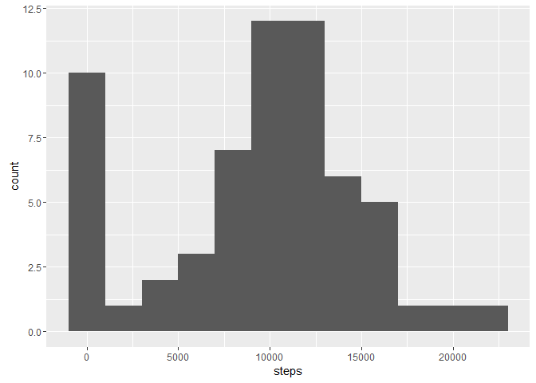
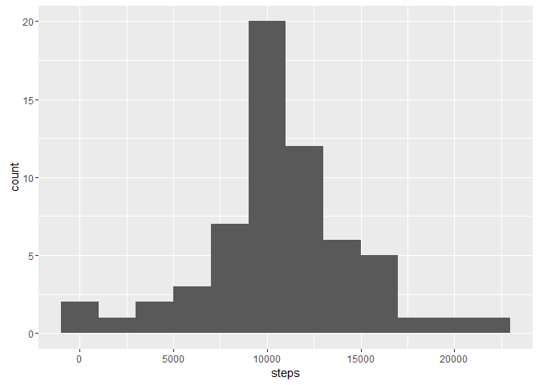

# Reproducible Research: Peer Assessment 1

## Loading and preprocessing the data
### First the setup:
This analysis requires several packages: `dplyr`, `ggplot2`

If these packages haven't been installed yet, this script will install them for you.
Then they will be loaded.


```r
## dplyr install and load
if("dplyr" %in% rownames(installed.packages()) == F) {
  install.packages("dplyr")
}
library(dplyr)
```

```
## 
## Attaching package: 'dplyr'
```

```
## The following objects are masked from 'package:stats':
## 
##     filter, lag
```

```
## The following objects are masked from 'package:base':
## 
##     intersect, setdiff, setequal, union
```

```r
## ggplot2 install and load
if("ggplot2" %in% rownames(installed.packages()) == F) {
  install.packages("dplyr")
}
library(ggplot2)
```

Now the dataset needs to be read in. 
This script assumes that the zipped data file has been saved to the working directory.
If the data hasn't been unzipped and placed in a folder named "data", this script will do it for you.
Then the CSV file will be read in to a data frame called `activity`


```r
if (!file.exists("./data/activity.csv")) {
  unzip("./activity.zip", exdir = "./data")
}
activity <- read.csv("./data/activity.csv")
```

The first part of this analysis will ignore missing values. 
First we will look at the total of all of the steps taken each day.
Therefore the data will need to be processed to look at each day as a whole, 
resulting in the `activity_by_day` data frame
Next, we will look at the data by interval averaged across all days and will 
process the data accordingly, resulting in the `activity_by_interval` data frame
This processing will be done with the `dplyr` package.


```r
activity_by_day <- group_by(activity, date) %>%
  summarize(steps = sum(steps, na.rm = TRUE))

activity_by_interval <- group_by(activity, interval) %>%
  summarize(steps = mean(steps, na.rm = TRUE))
```

## What is mean total number of steps taken per day?
First, a histogram:


```r
ggplot(data = activity_by_day, aes(x=steps)) +
  geom_histogram(binwidth = 2000)
```



Now let's look at the mean:

```r
mean(activity_by_day$steps)
```

```
## [1] 9354.23
```

Finally let's look at the median:

```r
median(activity_by_day$steps)
```

```
## [1] 10395
```

## What is the average daily activity pattern?
First, a time series plot of the average number of steps taken:


```r
ggplot(data = activity_by_interval, aes(x = interval, y = steps)) +
  geom_line()
```


Now lets determine which 5-minute interval, on average, contains the maximum number of steps:

```r
activity_by_interval[which.max(activity_by_interval$steps),1]
```

```
## Source: local data frame [1 x 1]
## 
##   interval
##      (int)
## 1      835
```

## Imputing missing values

First, lets see how many missing values the dataset contains:

```r
sum(is.na(activity$steps))
```

```
## [1] 2304
```

Now, we are going to impute data where it is missing. To do this, we will use the mean for each 5 minute interval.
Since the mean for each interval was already calculated, we will use the `dplyr` package to create the new dataset called `activity_impute` by joining the `activity` and `activity_by_interval` datasets.


```r
activity_impute <- left_join(activity, activity_by_interval, by = "interval") %>%
  mutate(steps = ifelse(is.na(steps.x), steps.y, steps.x)) %>%
  select(steps, date, interval)
```

### Comparing daily totals from dataset with imputed values to the original dataset:
First we need to process the data:


```r
activity_impute_by_day <- group_by(activity_impute, date) %>%
  summarize(steps = sum(steps, na.rm = TRUE))
```

Let's see how the histogram changed:


```r
ggplot(data = activity_impute_by_day, aes(x=steps)) +
  geom_histogram(binwidth = 2000)
```



Now let's look at the new mean:

```r
mean(activity_impute_by_day$steps)
```

```
## [1] 10766.19
```

Finally let's look at the new median:

```r
median(activity_impute_by_day$steps)
```

```
## [1] 10766.19
```
It looks like the data now has a more normal distribution. The data now seems to be centered around `10766.19` and doesn't have a second peak around `0`

## Are there differences in activity patterns between weekdays and weekends?
This part of the analysis uses the dataset with imputed values.
First we need to create a new variable that tells whether the date is a weekday or a weekend

```r
activity_impute_weekday <- mutate(activity_impute, weekday = weekdays(as.Date(date), abbreviate = T)) %>%
  mutate(day_type = factor(ifelse(weekday == 'Sun' | weekday == 'Sat',"weekend","weekday"))) %>%
  select(steps, date, interval, day_type)
```


Let's graph the average number of steps taken per 5-minute interval split out by weekdays/weekends
First, lets aggregate the data:

```r
activity_impute_weekday_by_interval <- group_by(activity_impute_weekday, day_type, interval) %>%
  summarize(steps = mean(steps, na.rm = TRUE))
```

Now, lets make the graph:

```r
ggplot(activity_impute_weekday_by_interval, aes(x = interval, y = steps)) +
  geom_line() +
  facet_grid(day_type~ .)
```


